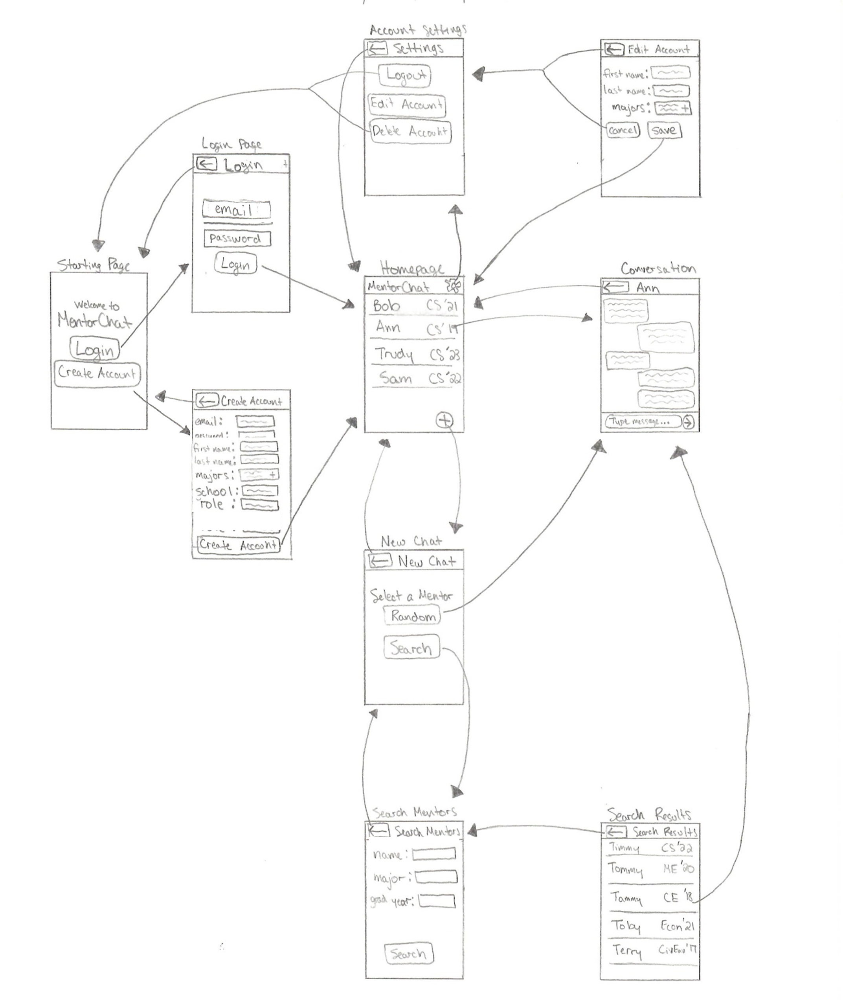
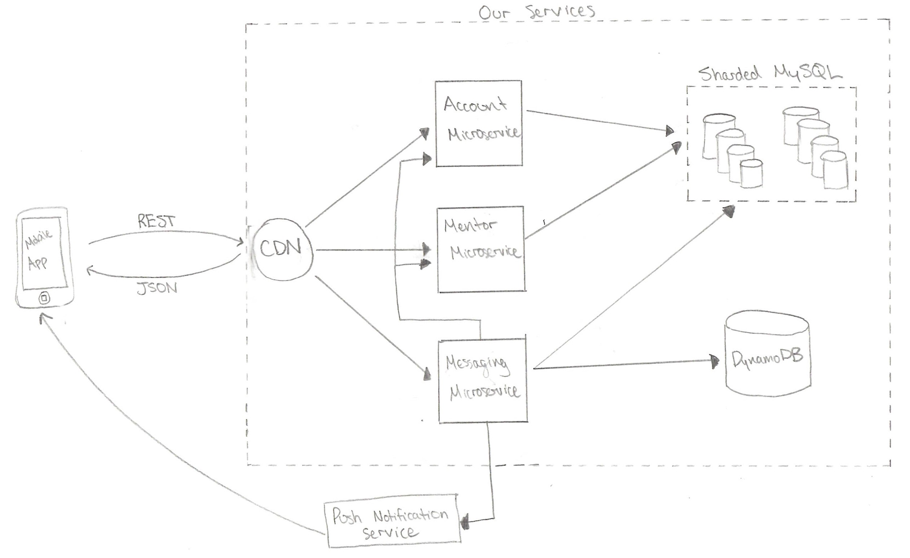
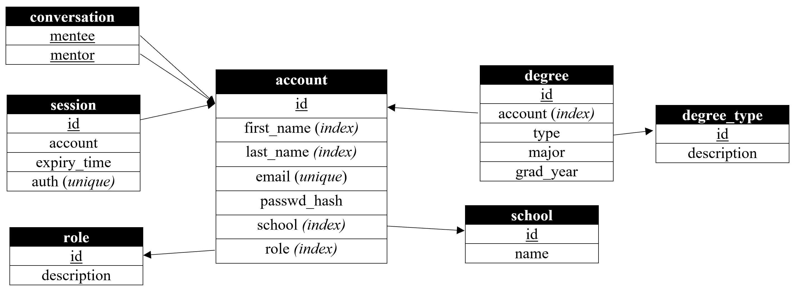

# MentorChat

MentorChat provides a chat service wherein prospecitve, current, and past students are able to register as one of two roles: a mentee seeking mentorship, or a mentor hoping to provide mentorship. A mentee will be able to search through the available mentors based on various characteristics such as name, major, and graduation year (anticipated or actual) in order to find a mentor that best fits the characteristics they want mentorship for. Conversely, a mentor account will wait for mentees to select them and initiate the conversation, thus mentor accounts will not have any of the user search features in their application. When signing up for the service, users will register with a particular school, typically the one they are attending or attended, which will then be permanently tied to their account. Mentor/Mentee relationships will only occur between users registered with the same school, which will enable easy sharding of the MySQL databases based on the registered school. The API of each of the microservices is described in the attached Swagger HTML export *architecture2.html* as well as on the [Swagger Website](https://app.swaggerhub.com/apis/sfitch/MentorChat/1.0.0).

## User Interface



## Arhcitecture Diagram



The application consists of a microservice backend with 3 distinct microservice APIs, 2 databases, and push notification support. The stateless microservices are all running in separate Elastic Beanstalk environments in order to provide seamless dynamic scaling of the system to accomodate the realized load.

### Component 1: Front-End UI
Users will interact through the service using a mobile app with the user interface shown above. Users start at the welcome page, which prompts them to either login or create an account. After sucessfully logging in or creating an account, the user will see a precurated list of their current conversations, with a settings icon in the upper right for account management settings. The user is able to swipe down on the home screen in order to manually refresh the messages on the app, which is similar to other common social media applications like Facebook and Snapchat. Clicking on any of the conversations on the home screen will move the user into the conversation window, which will function identically to most common messaging services with the messages displaying on opposite sides of the screen and a text field for the user to type in new messages. If the user is registered as a mentee, they will have a button in the lower right hand corner of the home screen which they can press in order to start a chat with a new mentor. The mentee can either start a chat with a random mentor or search through the mentors to find one that meets their desired characteristics. 

### Component 2: CDN

**Deployment Environment:** AWS CloudFront

The frontend proxy server acts as the point of entry for the clients to access all of the microservices associated with the application, while also providing caching for certain requests in order to improve the efficiency. For the Account microservice, the CDN will cache successful responses (HTTP 20x) to **GET /account/{accound_id}** for up to 24 hours in order to increase efficiency and limit traffic to the Account microservice while still allowing for updates to a user's account to eventually update within the application. For the Mentor microservice, the CDN will cache sucessful responses to **GET /mentors/search** with the same query parameters for up to 12 hours in order to reduce the load on the Mentor microservice, as it is not imperitive that new mentors immediately be available in the search results. No responses from the Messaging microservice will be cached in order to ensure that the user is always getting the most up-to-date message information within the application.

### Component 3: Account Microservice

**Language:** Java  
**Framework:** Tomcat web server  
**Deployment Environment:** AWS Elastic Beanstalk, with a load balancer and auto-scaling of the tomcat instances

The account microservice handles all of the account creation and logistics, such as creating and deleting accounts, logging users in and out, and validating authentication tokens. This microservice is responsible for loading in any new or updated account data into the MySQL database as well as managing the currently active authorization tokens for each user.

### Component 4: Mentor Microservice

**Language:** Java  
**Framework:** Tomcat web server  
**Deployment Environment:** AWS Elastic Beanstalk, with a load balancer and auto-scaling of the tomcat instances

The Mentor microservice enables quick and efficient searches accross the account MySQL database in order to allow mentees to easily search for a mentor with specified characteristics. This service is separated from the Account microservice to allow for more scaling flexibility, as it is likely that the account management service will have different load trends than the mentor service, as, even though they access the same data, they are used for two distinct purposes within the applicaiton.

### Component 5: Messaging Microservice

**Language:** Java  
**Framework:** Tomcat web server  
**Deployment Environment:** AWS Elastic Beanstalk, with a load balancer and auto-scaling of the tomcat instances

The Messaging microservice provides all of the tools for the mentees and mentors to communicate within the app. The service can be used to send messages between users, retreive a user's homepage list of conversations, and retreive the messages for a given conversation. This service is reponsible for adding new conversations to the MySQL database, which uses the mentee and mentor ids as a combination primary key within the conversation table, as shown in the schema below. Additionally, this service writes new messages to each conversation in the DynamoDB and is responsible for retreiving these messages upon user request.

### Component 6: Sharded MySQL Database

The account information is stored in a sharded MySQL database structure. Since users sign up with a particular school within which all of the mentor/mentee relationships will occur, the account data can very easily be sharded based on the school tied to the account, thus providing the ability to scale the read/write throughput as the user base grows.



### Component 7: DynamoDB

The DynamoDB stores all of the messages for each of the conversations. The database primary key consists of the *mentee_id* and *mentor_id* concatenated together as strings to create the parition key, while the *time_sent* in Epoch time is used as the sort key. Using the time sent as our sort key makes it very easily to maintain the proper ordering of the messages within the conversation. The schema for each database entry is shown below:

```JS
(mentee_id+mentor_id, epoch(time_sent)) -> {
     from: integer, 
     to: integer,
     time_sent: "YYYY-MM-DD-THH:MM:SSZ",
     content: string 
     }
```

### Component 8: Push Notifications

The application will support both Apple and Android push notifications in order to notify users when they have received a message, even when they are not actively using the app. The push notification will contain the full information for the message, which includes the sender_id, recipient_id, message contents, and timestamp of when the message was sent. If the user has the application open when a push notifcation arrives, then they will not receive a banner notifcation like they would if the app were backgrounded; instead the UI will simply update to include the new message in its contents. In order to ensure that the application is not entirely reliant on the push notification service to deliver messages, the application will make a manual GET request to the messaging service to retreive messages when the user opens the app. Additionally, the user will also have the ability to manually refresh the messages in the UI.
