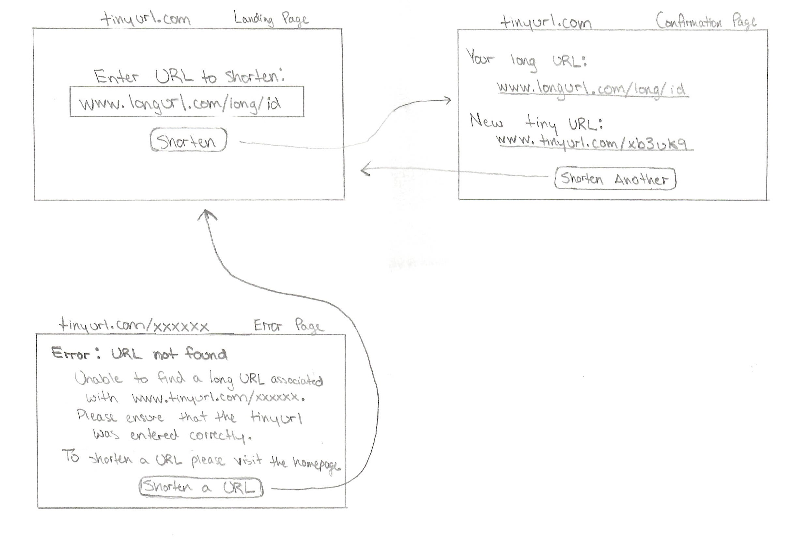
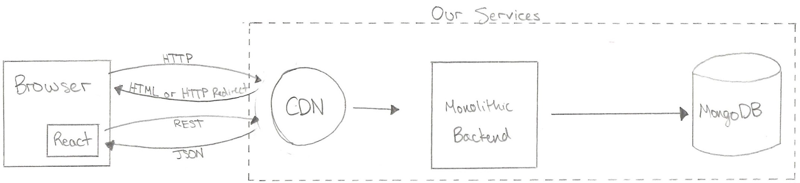

# TinyURL

## User Interface


## Architecture Diagram


### Component 1: Front-End UI

Clients will only interact with the REACT frontend in their browser when they are creating a new TinyURL by navigating their web browser directly to *www<span>.tinyurl.<span>com* or when they have entered an invalid TinyURL address, such as *www<span>.tinyurl.<span>com/xxxxxxxx*, as shown above in the UI diagram. If the URL the user requests is a valid TinyURL, then the user will follow an HTTP 301 Redirect to the desired site without interacting with the TinyURL UI at all.

### Component 2: CDN
 
**Deployment Environment:** AWS CloudFront
 
The AWS CloudFront CDN is able to cache many of the repeat requests to the backend in order to greaty reduce the actual load expereinced by the backend. The CDN will permanently cache the response to the **GET /** response until we manually update it, since this single page application will be served the exact same way for all users until we make some manual change to the file, at which point we can update the entry in the CDN. The CDN will also cache all of the successfull redirects (HTTP 301) for the **GET /{tiny_url}** endpoint, as the current application structure never changes or removes existing *tiny_url*s in the database, meaning that once a successful redirect is acheived for a specific *tiny_url*, that endpoint will always redirect to the same location.

### **Component 3: Monolithic Backend**
  
**Language:** Java \
**Framework:** Tomcat web server \
**Deployment Environment:** AWS Elastic Beanstalk, with a load balancer and auto-scaling of the Tomcat instances

The backend is running a stateless Java application, which responds to GET and POST requests for handling webpage functions as well as the TinyURL redirecting via HTTP. The API interface for this application is defined in the attached Swagger *architecture1.html* file as well as on the [Swagger website](https://app.swaggerhub.com/apis/sfitch/TinyURL/1.0.0). Each TinyURL will be composed of 8 alphanumeric characters (A-Z, 0-9) that will be generated by each instance of the backend individually. When each instance is initialized, it is assigned a certain subsection of the address space that it will use to generate new TinyURLs. Assuming we will be running at most 36 instances simultaneously (which can be configured in AWS), each instance will be assigned one alphanumeric character that will be the first character in the generated TinyURL. For example, the first instacne would have the address space *Axxxxxxx*, the second *Bxxxxxxx*, and so on. Spliting the address space in this way means that we do not need to worry about synchronizing the TinyURL generation between instances to prevent collisions. The remainder of the address for each generated TinyURL will be generated using a counter within each instance that will increment with each TinyURL that is generated. Adding this small amount of state within each instance greatly limits the number of requests that need to be made to the database, as we will not need to check for collisions in the TinyURLs we generate like we would if we were randomly generating the TinyURLs or if we had not paritioned the address space across the different instances of the application.

### **Component 4: MongoDB**
A MongoDB will contain all of the information regarding the key-value pairs between the shortened *tiny_url* and the original *full_url* to redirect to. Using a NoSQL database structure will allow our database to easily scale and be partitioned in order to optimize performance based on the load the service experiences. The database will use the generated *tiny_url* as the key to the database, with each entry having the structure shown below:

```JS
    tiny_url -> {
        "full_url": string
    }
```
