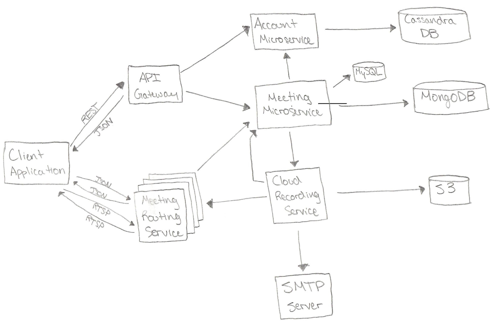
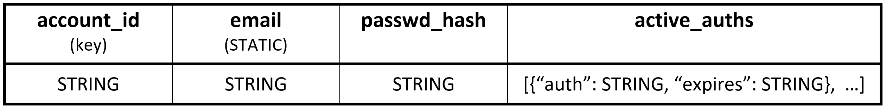
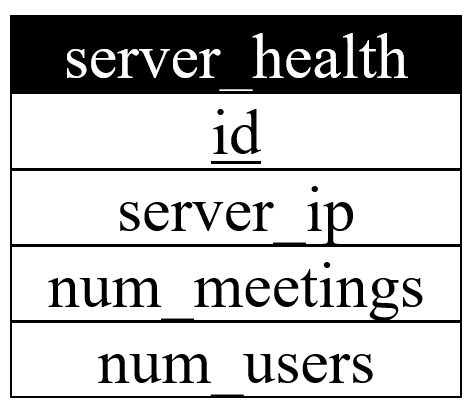

# Video Conferencing

## Architecture Diagram


## Architecture Components

### Component 1: Client Application

The users will only interact with the video conferencing service through the associated client application. The application could be made to run on any and all of iPhone, Android, Mac, Windows, and Linux as the overall functions that the application provides are easily implementable on all of the platforms. The only thing that may differ between the versions is having virtual background restricted based on the computing power of the user's device, otherwise the applications will be functionally idential.

The client application will be responsible for subscribing to at most 49 of the different available video feeds within the meeting. The application will communicate with the meeting routing service to establish and change these subscriptions dynamially thorughout the call.

The computations for the virtual background feature are done locally on the client application. The user's video is analyzed in real time using the BodyPix object detection library, which will create a mask of the user's body within the video. Using this mask, the application can then overlay the user onto any other photo of their choosing for the virtual background. Additionally, if the user just wants a standard background blur, the background will be a real-time Gaussian blur of the original video feed with the user then masked back in on top. The new video feed with the virtual background is then what is sent to the meeting routing server. 

### Component 2: API Gateway

**Deployment Environment:** Amazon API Gateway

The API gateway frontend proxy serves as a point of entry for the client into the microservice backend of the application. Based on the path in the HTTP request header, the proxy server will redirect the HTTP packet to the appropriate microservice for the actual processing (Account microservice for */account* requests and Meeting microservice for */meeting* requests).


### Component 3: Account Microservice

**Language:** Java  
**Framework:** Tomcat web server  
**Deployment Environment:** AWS Elastic Beanstalk, with a load balancer and auto-scaling of the tomcat instances

The stateless account microservice handles all of the user account creation, management, and verification within the application. Users of the application will need to sign up for an account with their email and password in order to receive a unique identification (*account_id*) that can be used to identify and verify their identity throughout the service. For many of the enpoints, users are required to provide their authentication token in the "Authorization" HTTP header; this will then be checked with the records in the Cassandra database to ensure the token is currently valid. The API for this microservice is specified in the attached Swagger HTML export *architecture4.html* as well as on the [Swagger Website](https://app.swaggerhub.com/apis/sfitch/Architecture4/1.0.0).


### Component 4: Cassandra Database

The Cassandra database stores all of the account information, which includes the user's unique account id, unique email, password hash, and active authorization tokens. Each entry in the active_auths list is a pair of the authorization token and its expiry time in Epoch. The schema for the database is shown below:



### Component 5: Meeting Microservice

**Language:** Java  
**Framework:** Tomcat web server  
**Deployment Environment:** AWS Elastic Beanstalk, with a load balancer and auto-scaling of the tomcat instances

The stateful meeting microservice handles all of the application features associated with the video conferencing meetings, including creating, joining, recording, and ending meetings. The API for this microservice is specified in the attached Swagger HTML export *architecture4.html* as well as on the [Swagger Website](https://app.swaggerhub.com/apis/sfitch/Architecture4/1.0.0).

One job of this service is to assign each meeting to a single Meeting Routing server when the user makes a *"POST /meeting"* request. In order to do this efficiently, each Meeting microservice instance maintains a small amount of state about the load on the system to best determine where to send a given meeting. In particular, the service maintains a state of:
1. List of available meeting routing servers
2. Number of meetings active on each server (copied from MySQL database)
3. Number of users in each meeting on each server (copied from MySQL database)
4. Net change to the number of meetings (based on number of meeting create/end requests handled by this instance since last MySQL update)
5. Net change to the number of users in each meeting (based on number of meeting join/leave requests handled by this instance since last MySQL update)

Since this service will have many instances running in parallel in the Elastic Beanstalk, every so often (5-10 minutes), each instance will adjust the load data in the MySQL database with its net changes to the load (*4.* and *5.* above). At this time, the instance will also copy the updated load data from the MySQL database (*2.* and *3.* above) in order to have a more up-to-date understanding of the total load on the meeting routing service. Having each service update this data periodically limits the number of reads/writes that need to happen to the MySQl server while still enabling efficient distribution of load across all of the server instances.

The client application and meeting routing servcie will make various calls to this microservice, as described in the *meeting* API, in order to communicate the actions they performing (creating, joining, leaving, ending a meeting) so that the service can update its load balancing data accordingly. The actual act of joining, leaving, and ending a meeting is handled by the meeting routing service; these enpoints serve solely to communicate to the Meeting microservice what is going on in terms of load on the service. The clients make the */meeting/join* and */meeting/leave* updates so that the Meeting Routing server can focus solely on routing traffic between clients while a meeting is active; once the meeting has concluded, as described in Component 8, we have the Meeting routing service make the */meeting/end* call so that we have authoritative information about when a meeting has officially ended.

When the user wants to record a meeting, it makes a *"POST /meeting/record/{meeting_id}* request to this microservice. When the first user requests a recording for a given meeting, the microservice assigns a cloud recording worker (Component 9) to begin recording the meeting. The API will then return a response letting the user know that the recording has sucessfully begun. Any subsequent recording requests for the same meeting will just be added to the list of recording recipeints whom will be sent a link to the final recording once the meeting has concluded.

### Component 6: MySQL Database

The small MySQL database is used by the Meeting microservice to track the health and load on each of the Meeting Routing servers. The schema of the single table is shown below:



### Component 7: MongoDB

The documents stored in the MongoDB will store all of the infromation associated with each meeting. Thus, the document key will just be the *meeting_id* for the particular meeting. Each document contains the *account_id* of the host, which is the person who originated the meeting and is the only person who can end the meeting. Additionally, the document tracks whether the meeting is being recorded and a list of *account_id*s of who to email the URL of the finished meeting recording to. When a meeting has concluded but the record must persist for the cloud recording microservice (for list of record recipients), the *"server"* parameter will be set to an empty string to signal to the application that the meeting has concluded. The schema for each document in the database is shown below:

```JS
meeting_id -> {
    "meeting_id": STRING,
    "host": STRING,
    "server": STRING, 
    "recording": BOOLEAN,
    "record_recipients": [STRING, ...]
}
```

### Component 8: Meeting Routing Microservice

**Language:** Java  
**Deployment Environment:** Amazon EC2 instances

The statefull Meeting Routing service consists of many Amazon EC2 instances that will serve as the routing hub for all of the videoconferencing traffic. Each meeting will be assigned a specific server instance by the Meeting microservice, which can handle the routing of multiple meetings simultaneously through multithreading. The client application will then connect to the assigned meeting routing server over a WebSocket in order to begin and manage the meeting. The routing microservice maintains a state of the following pieces of information:

1. *account_id* of the host of each meeting
2. Which *meeting_id*, *account_id*, and function each socket corresponds to
3. Which video feeds each *account_id* is subscribed to

Each user will establish 3 different categories of socket connections with the meeting routing server:

1. WebSocket for communication with server, such as joining, leaving, and updating video subscriptions
2. UDP socket using RTSP for uploading user audio and video data at multiple bitrates via SVC
3. UDP socket using RTSP for downloading each audio and subscribed video stream

Each client will have multiple instances of *Socket #3* for downloading each of the audio and subscribed video streams in the meeting.

Each packet sent over the WebSocket contains the *meeting_id* of the meeting the user is in, as well as the *content_type* of the message to communicate how to interpret the contents of the packet. The schema for the JSON packets that will be sent over the WebSocket is specified below: 

```JS
// Meeting Start Packet //
{
    "meeting_id": STRING,
    "content_type": "INIT",
    "host": STRING   }

// Meeting Join Packet //
{
    "meeting_id": STRING,
    "content_type": "JOIN",
    "account_id": STRING
}

// Join Denied Packet //
{
    "meeting_id": STRING,
    "content_type": "JOIN_DENIED"
}

// Error Packet //
{
    "meeting_id": STRING,
    "content_type": "ERROR",
    "msg": STRING
}

// Meeting Users Packet //
{
    "meeting_id": STRING,
    "content_type": "MEETING_USERS",
    "users": [STRING, ...]
}

// Meeting Leave Packet //
{
    "meeting_id": STRING,
    "content_type": "LEAVE",
    "account_id": STRING
}

// Meeting End packet //
{
    "meeting_id": STRING,
    "content_type": "END"
}

// Subscribe to Video Feeds //
{
    "meeting_id": STRING,
    "content_type": "SUBSCRIBE",
    "num_actions": INTEGER,
    "subscriptions": [
        {"account_id": STRING,
         "bitrate": INTEGER}, 
        ...
    ]
}

// Unsubscribe from Video Feed //
{
    "meeting_id": STRING,
    "content_type": "UNSUBSCRIBE",
    "num_actions": [
        {"account_id": STRING,
         "bitrate": INTEGER},
        ...
    ]
}

// Subscribe/Unsubscribe Combination Packet //
{
    "meeting_id": STRING,
    "content_type": "UNSUB_SUB",
    "num_actions": INTEGER,
    "unsubscribe": [
        {"account_id": STRING,
         "bitrate": INTEGER},
        ...
    ], 
    "subscribe": [
        {"account_id": STRING,
         "bitrate": INTEGER},
        ...
    ]
}

// Record Microservice Join Packet //
{
    "meeting_id": STRING,
    "content_type": "RECORD_JOIN"
}
```

When a new user joins the meeting, they begin receiving all of the audio data as well as a list of the current users in the meeting via the "Meeting users packet". For all members currently in the meeting, they are relayed the users "Meeting join" packet to notify them that a new user has entered the meeting; similarly, when a user leaves a meeting, their "Meeting leave" packet is relayed to all participants of the meeting to notify them that the user has left the meeting. The client applicaiton will use this list of active participants in order to subscribe to and unsubscribe from different video streams through the service. When a user subscribes to a video feed from a particular *account_id*, whenever the meeting routing service receives a RTSP packet tied to that *account_id* it will duplicate the packet and send it to all sockets that have subscribed to that video feed. The client application will be responsible for synthesizing these discrete packets into the actual video stream that will be displayed to the user.

When the routing service receives a *Meeting End packet* from the host of the meeting, it then begins the meeting shutdown process. First, the routing service relayes the meeting end packet to each of the WebSockets connected to the meeting to signal to the clients that the meeting has ended. The service will then close all of the sockets and make a *"POST /meeting/end/{meeting_id}"* request to the Meeting microservice, which will update the record in the MongoDB to signal the meeting has concluded to anyone else that tries to join. If the meeting is not being recorded and the meeting information is no longer needed, then the above request will just delete the record from the MongoDB. If the meeting is being recorded, then the record will persist with a *"server'* field of an empty string to signal that the meeting has ended. The Cloud recording microservice will then make a *"DELETE /meeting/{meeting_id}"* request to delete the meeting record from the MongoDB entirely when it has finished.

### Component 9: Cloud Recording Microservice

**Language:** Java  
**Deployment Environment:** AWS Elastic Beanstalk worker environment, with load balancing and auto-scaling of the instances

This microservice acts as a worker delegated by the Meeting microservice to do the actual recording of the meeting when the user makes a *"POST /meeting/record/{*meeting_id*}"* request. The service will connect to the meeting server using the "Record join" packet to signal to the server that it is an instance of the recording microservice connecting, not just a standard client. The Meeting microservice will record the time in epoch when it does this for use in the S3 filename, as described in Component 10. The recording microservice will then act as a "ghost" participant in the meeting; the service will not establish any UDP sockets for sending audio or video data, but will instead only establish the UDP sockets for receiving audio and video data. Just like a standard client, the microservice will subscribe to at most 50 (1 more since it does not have an upstream) different video streams from the meeting, which it will record and save to a video file. Once the meeting has finished (signified by a *meeting_end* packet over the WebSocket), the service will finish recording/rendering and upload the final video to S3. The link to the video on S3 will then be sent over email to all of the accounts that requested the recording, which can be retreived by making a *"GET /meeting/record/recipients/{meeting_id}"* request. After all of these steps have concluded, the service deletes the meeting entry from the MongoDB with a *"DELETE /meeting/{meeting_id}"* request and releases its resources so that it can handle another task assigned to it by the Meeting microservice.

### Component 10: S3 Storage

All of the cloud recordings will be stored within an S3 bucket. Once the Cloud Recording microservice has finished saving and rendering a given recording, it will upload the final video file to S3 with the filename structure of *"{meeting_id}_{time in epoch when recording started}"*. The final URL of this video is then sent over SMTP as described in Component 9 and 11. The video files will be accessible only to those who have the specific URL to access the video; the bucket itself will not be publicly accessible or searchable, only the individual objects within it are accessible through the direct URL. 

### Component 11: SMTP service

**Deployment Environment:** Amazon Simple Email Service (SES)

Using the standard email delivery protocol (SMTP) and an Amazon SES system, the application delivers email notifications when cloud recordings have finished being rendered and uploaded to S3. The Cloud Recording microservice will interact with the SES service over SMTP in order to send out the notification emails to all of the users that pressed the *"Record"* in the UI during the meeting. The email will contain a brief message and then the URL that links directly to the recording within S3.
